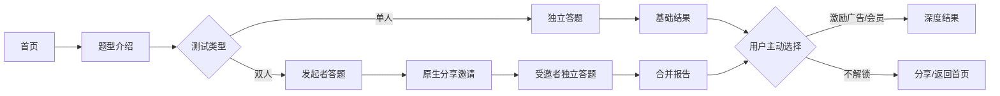

# 心动测测（暂定）微信小程序 PRD V1.0

## 一、文档信息与变更摘要

| 项目 | 内容 |
|---|---|
| 需求名称 | 心动测测微信小程序 V1.0 |
| 所属业务域 / 版本 | 泛娱乐测试 / V1.0 |
| 优先级 | P0：题库、单人测试、双人测试、结果、后台运营；P1：会员、广告、历史；P2：主题活动 |
| 目标平台 | 微信小程序；运营后台 Web |
| 目标用户 | 情侣/暧昧关系用户；泛年轻人娱乐测试用户 |
| 文档状态 | 可供 UI、开发、测试及提审准备使用；待确认项见第十章 |
| 变更摘要 | 首版建立可配置的单人/双人趣测与题库运营闭环；不将测试包装为心理诊断或关系裁决。 |

### 1.1 产品一句话

为年轻用户提供可分享的**人格与相处风格娱乐测试**：一个人可完成单人趣测；两个人可各自作答后查看相处默契报告。

### 1.2 产品原则

1. **娱乐而非诊断**：结果固定展示“仅供娱乐与自我了解参考，不构成心理、医疗、婚恋或职业建议”。
2. **先获得价值，再选择变现**：基础结果免费可见；广告和会员用于解锁增值内容，不阻断进入或基础结果。
3. **双方独立、双方同意**：双人测试不展示单题答案，不替任何一方下结论。
4. **内容后台化**：题型、题目、计分、结果、素材、上架时间、广告/权益规则均由后台配置并版本化，客户端不得写死。
5. **合规优先于热点**：首版不做“性瘾指数”、疾病筛查、抑郁/焦虑诊断、露骨性内容、低俗羞辱或针对未成年人的亲密关系题目。

---

## 二、背景、目标、非目标与范围

### 2.1 背景

人格标签、相处默契和热点玩梗具有低门槛、强结果分享属性。情侣/暧昧关系用户具有天然的双人邀请需求；泛年轻用户可通过单人测试形成内容平台的自然流量。测试题库若依赖客户端发版，将无法快速响应热点，也无法准确复盘题型效果。

### 2.2 目标

- 建立可长期维护的测试内容体系和后台审核发布能力。
- 完成“选题 → 答题 → 基础结果 → 深度解锁/分享 → 历史复测”的单人闭环。
- 完成“发起 → 邀请 → 双方独立答题 → 合并结果”的双人闭环。
- 为广告与会员保留可灰度、可关闭、可审计的变现能力。
- 形成可用于选题淘汰和投放评估的漏斗数据。

### 2.3 非目标

- 不提供心理疾病筛查、诊断、治疗、危机干预或医疗咨询。
- 不提供真实身份验证、婚恋撮合、陌生人交友、聊天社区或公开排行榜。
- 不采集通讯录，不自动识别微信好友关系，不展示对方逐题答案。
- 不以“分享后解锁”“邀请助力”作为功能或权益条件。
- 不在 V1 开发 AI 自由对话出题、原生直播、复杂社群或跨端 App。

### 2.4 本期范围

1. 单人测试：选题、介绍、答题、基础结果、深度结果、分享海报。
2. 双人测试：发起、微信分享邀请、双方独立答题、等待页、合并报告、失效与退出。
3. 首页/分类：内容运营位、分类浏览和运营排序。
4. 我的：测试记录、双人记录、会员、设置、协议与删除记录。
5. 商业化：用户主动触发的激励视频解锁、会员鉴权、广告位和商品后台配置。
6. 运营后台：题型、题目、计分、结果、素材、排期、审核、版本、数据看板。
7. 上架准备：协议、隐私、免责声明、反馈/举报、内容审核和测试清单。

### 2.5 不在本期范围

- H5、抖音/小红书/支付宝小程序多端发布。
- 付费咨询、医生/心理咨询师服务、治疗推荐。
- 用户投稿题目、评论、公开社交关系图谱。
- 成人敏感测试专区。若后续评估，必须单独完成内容、年龄分级、审核和法律审查。

---

## 三、用户与用户故事

| 编号 | 用户故事 | 优先级 | 验收摘要 |
|---|---|---|---|
| US-01 | 作为泛年轻用户，我想快速完成一个有趣的单人测试并获得可分享结果。 | P0 | 不登录也可完成基础流程；基础结果可见。 |
| US-02 | 作为情侣/暧昧用户，我想邀请特定对象各自完成题目，看到双方的相处偏好。 | P0 | 双方完成后才生成合并报告；单题答案默认不可见。 |
| US-03 | 作为用户，我想主动选择看广告或开会员来取得更多解释。 | P1 | 激励解锁和会员权益由服务端确认；原操作可恢复。 |
| US-04 | 作为回访用户，我想找到以前的报告并重新测试。 | P1 | 历史列表可查看、删除；题型新版本不覆盖旧报告。 |
| US-05 | 作为内容运营，我想不发版地新建、审核、定时上线和下线题型。 | P0 | 后台题型/题目/结果/版本/排期可配置并有审计记录。 |
| US-06 | 作为审核/客服人员，我想处理投诉、删除请求及异常内容。 | P1 | 有反馈入口、内容下线、用户数据删除和脱敏定位能力。 |

### 3.1 用户分层

| 层级 | 可用能力 | 限制 |
|---|---|---|
| 匿名/游客 | 浏览、单人基础测试、本机最近记录、发起/参与双人测试 | 不保证跨设备恢复；付费前按服务端规则绑定可恢复身份。 |
| 已识别用户 | 云端历史、会员购买、跨设备恢复 | 仅展示最小化资料，不强制获取头像昵称。 |
| 有效会员 | 免费能力 + 会员配置的深度结果/去激励广告权益 | 仍受公平使用、内容下线及风控限制。 |
| 运营人员 | 后台内容、审核、排期、数据看板 | 角色授权；不得导出原始答题内容。 |

---

## 四、全局规则与复用能力

### 4.1 启动与协议

- 首次启动展示《用户协议》《隐私保护指引》《娱乐测试免责声明》；用户未同意前不得初始化非必要统计、广告或营销 SDK。
- 启动后进入首页或安全恢复的来源页。启动广告能力在 V1 默认关闭，**不得将激励视频作为冷启动强制步骤**。
- V1 不展示新手引导页；用户同意协议后直接进入首页或安全恢复的来源页。测试规则与娱乐性质在题型介绍、双人邀请和结果页就地说明；版本和素材由后台配置。
- 协议版本变更后，需在下次进入核心功能前重新确认；加载失败显示重试，不展示空白页。

### 4.2 隐私、内容与权限

- 仅收集完成服务所需的匿名用户标识、答题选项、题型/版本、测试时间、权益状态和必要设备诊断信息。答题内容按敏感偏好数据标准保护。
- 不申请通讯录、定位、相机、麦克风。用户点击“保存结果海报”时，按微信能力要求申请相册保存权限；拒绝后可继续使用，只是不保存图片。
- 双人测试中，对方只可获知“已完成/未完成”和最终聚合报告；不得获取对方昵称、头像、设备或逐题答案，除非未来另立需求并取得双方明示同意。
- 原始答案、邀请令牌、订单信息不得写入埋点、崩溃日志、客服文本或前端缓存日志。保留期、删除周期和备份清理周期为后台配置。
- 用户可在“我的—设置—隐私与数据”删除单份报告或申请删除账号关联数据；删除后进入异步删除任务，前台显示处理状态。

### 4.3 广告、会员与鉴权

| 能力 | 免费用户 | 有效会员 | 产品规则 |
|---|---|---|---|
| 基础结果 | 可查看 | 可查看 | 永不因广告或会员拦截。 |
| 深度解析 | 按测试配置：免费、激励解锁或单次购买 | 按会员权益直接查看 | 高风险/敏感题型不得以广告或付费墙阻断提示/结果。 |
| 激励视频 | 用户点击“观看视频解锁”后展示 | 不展示激励入口或显示已免广告 | 奖励在广告完整观看并由服务端确认后发放。 |
| 插屏/封面广告 | 仅后台开启且符合平台规则时展示 | 按会员权益关闭 | 仅位于自然停顿页；关闭后不在同一页面重复弹出。 |
| 历史报告 | 按后台配置的免费范围 | 按会员权益提供扩展范围 | 不影响用户删除数据。 |

统一鉴权结果：`ALLOW`、`REQUIRE_LOGIN`、`REQUIRE_PURCHASE`、`PENDING_CONFIRMATION`、`LIMIT_REACHED`、`UNAVAILABLE`、`DENY`。服务端为最终判定方；客户端支付回调或本地缓存不得直接解锁。

### 4.4 数据、状态与可观测性

- 所有读请求只渲染最后一次有效响应；写请求带 `idempotency_key`，避免重复提交答卷、重复创建邀请或重复发放权益。
- 远程页面必须具备加载、空、成功、失败、重试和降级状态；网络失败不得清空已答题目。
- 记录脱敏事件名、页面、题型 ID、版本、状态码、耗时、重试次数和匿名会话 ID；禁止记录原始选项文本和关系报告全文。
- 错误通过统一错误码映射为用户文案；不可用、下线、审核中等情况展示真实原因，不得误导用户购买会员。

---

## 五、功能需求

### 5.1 题型体系与内容运营（P0）

#### 5.1.1 题型定位与长期维护策略

题型采用“三层内容池”，每个题型必须拥有独立的测试 ID、版本、内容标签和审核状态。

| 内容层 | 定位 | 推荐题型方向 | 生命周期与维护 |
|---|---|---|---|
| 常青池 | 稳定流量、长期复测、会员承接 | 社交能量、沟通风格、恋爱依恋/边界、朋友默契、情侣冲突修复、约会偏好、职场协作、动物人格 | 常驻；按数据和文案季度复审。 |
| 场景池 | 节日和生活情境的运营位 | 七夕默契、异地相处、毕业友情、旅行搭子、团建角色、年终社交复盘 | 按排期上线；结束后归档或复用。 |
| 热点实验池 | 获取新流量、验证题材 | 网络热梗、流行表达、剧综讨论点的原创趣测 | 小流量灰度；到期/低数据自动下线。不得未授权使用 IP、明星肖像或原题。 |

V1 确认仅发布以下三项题型；题目、结果和计分规则均由运营后台按题型版本配置。

| 题型 | 类型与题数 | V1 玩法 | 结果与内容要求 |
|---|---|---|---|
| 你是哪种牛马性格测试？ | 单人，22 题，全部单选 | 用户完成全部题目后提交并查看结果。 | 输出职场风格的娱乐化角色和建议；避免贬损、羞辱或职业能力判断。 |
| 你的 X 偏好？ | 单人，20 题，全部单选 | 用户完成全部题目后提交并查看结果。 | `X` 的具体主题、结果维度和结果文案待内容确认；UI 和后台按可替换标题/结果模板设计。 |
| 双人关系角色测试 | 双人，每人 30 题，全部单选 | 发起者只需完成一次自己的答卷，即可为不同对象分别创建多个一人一码的配对会话；每名受邀者完成自己的 30 题后，与发起者查看一份独立的关系角色报告。 | 每份报告只属于一对参与者；不展示双方逐题答案，不给出关系成败等确定性结论。 |

所有 V1 题型不支持跳题；只有答完全部必答题才允许提交。不得使用“MBTI 官方测试”表述及其版权题目；如采用 16 型结构，只能使用自主撰写的“人格偏好趣测”及独立命名和结果文案。

#### 5.1.2 运营后台功能

| 模块 | 运营操作 | 关键规则 |
|---|---|---|
| 分类与标签 | 新建、排序、启停、配置受众/主题/内容等级 | 分类改动不改变已生成报告。 |
| 题型 | 新建草稿、复制、编辑、预览、提审、排期、发布、下线、归档 | 发布后不可直接改写；改动必须创建新版本。 |
| 题目 | 单选、多选（V1 建议只用单选）、图文选项、权重、跳题规则 | 题目编号稳定；删除已发布题目只能通过新版本实现。 |
| 计分与结果 | 维度、权重、分段、结果卡、基础/深度内容、分享文案 | 必须先通过模拟答案校验，防止无结果或多结果。 |
| 素材与运营位 | 首页 Banner、封面、结果背景、推荐位、排序 | 素材需版权来源和审核记录；加载失败使用默认图。 |
| 审核工作流 | 内容审核、合规审核、发布审批、下线、审计 | 制作者不能单独完成终审和发布；紧急下线可由授权角色执行。 |
| 数据看板 | 浏览、开始、完成、结果、分享、邀请、激励、付费、投诉 | 仅呈现聚合数据；无原始答卷下载入口。 |

#### 5.1.3 题型状态机

`DRAFT（草稿） → REVIEWING（审核中） → SCHEDULED（待发布） → PUBLISHED（已发布） → OFFLINE（已下线） → ARCHIVED（归档）`

- 审核驳回回到草稿并保留原因；发布与下线均保留操作人、时间、版本和原因。
- 已发布题型在新用户入口下线后，旧报告仍按后台保留策略可查看；若涉及风险下线，结果页改为“内容已下线”，不继续展示或分享。
- 计分规则、题目顺序、基础/深度结果任一变更均生成 `test_version`；报告永久绑定生成时版本，保证可复现。

#### 5.1.4 内容审核红线

- 禁止色情露骨、性暗示、低俗羞辱、歧视、PUA、暴力、自残自杀、赌博、迷信和诱导未成年人不良行为。
- 禁止宣称“准确诊断”“判定你是否有病”“一定适合/不适合某人”“可用于招聘/录取/择偶决策”。
- 禁止使用他人商标、题目、报告、影视/明星/角色形象等未获授权内容。
- 所有结果避免负面绝对化标签。涉及情绪困扰的内容须提供中性提示和官方/专业求助建议，不展示广告解锁。

### 5.2 首页与分类（P0）

- **入口与前置条件**：启动完成后进入首页；无需登录。
- **页面结构**：Banner、双人测试主入口、热门推荐、常青分类、场景专题、最新上架、我的入口。
- **交互**：点击题卡进入介绍页；点击分类筛选首页当前展示内容。无独立搜索入口、搜索页、关键词输入或无搜索结果页。
- **排序**：运营排序优先，其次按推荐策略；热门值由服务端聚合计算，客户端不自行计算。
- **异常**：配置拉取失败时显示默认常青题型；全部不可用时展示空状态与刷新按钮。
- **埋点**：`home_view`、`banner_click`、`test_card_impression`、`test_card_click`、`category_click`。

### 5.3 单人测试（P0）

#### 5.3.1 测试介绍页

- 展示封面、题型名称、标签、预计时长（后台配置）、题数（后台配置）、适用人群、免责声明、基础/深度权益说明。
- 用户点击“开始测试”时，服务端校验题型状态和当前版本；已下线或不适用则留在原页提示原因。
- 不以登录、分享、广告作为开始测试前置条件。

#### 5.3.2 答题页

- 一题一屏；展示进度、返回、退出、选项。V1 使用单选题，降低题库和计分复杂度。
- 选中后自动进入下一题；返回时保留已选项；退出二次确认，选择“暂存退出”保存进度（后台开关）。
- 最后一题提交前显示“提交并查看结果”；提交请求必须幂等。提交中禁止重复点击。
- 不在答题中插入广告、付费弹窗或营销浮层。
- 异常：断网时保留本地草稿；恢复后仅提交最新、完整且未过期的答卷。题型版本下线时不再提交，提示重新选择测试。

#### 5.3.3 结果页

- 基础区：结果名称、简要描述、维度图（如适用）、积极建议、免责声明。
- 深度区：场景化解析、相处建议、反向建议、可讨论话题、主题结果卡。是否可见和解锁方式由后台按题型/用户权益返回。
- 用户可主动选择：观看激励视频解锁、购买单次权益（如配置）、开通会员、直接返回。激励加载失败时允许重试或显示其他合法解锁方式；不得假装已解锁。
- 分享仅提供平台原生分享和保存海报能力，不附加“分享后解锁”奖励。分享卡不得展示用户原始答案。
- 结果页提供再次测试、推荐同类题型和返回首页，不提供收藏入口。
- 埋点：`test_start`、`question_answer`（仅题号，不传选项内容）、`test_submit`、`result_view`、`premium_exposure`、`rewarded_ad_click`、`rewarded_ad_complete`、`deep_result_unlock`、`share_click`、`save_poster`、`retest_click`。

### 5.4 双人测试（P0）

#### 5.4.0 V1 双人关系角色测试玩法

- 发起者先完成 30 道单选题，生成一份与 `test_version` 绑定的个人答卷快照。
- 发起者可基于这份答卷快照为不同对象创建多个独立配对码；每个配对码只能被一名受邀者使用，且有效期和创建频率由后台配置。
- 受邀者使用配对码进入后，独立完成同一版本的 30 道单选题。双方完成后，系统仅为这一对参与者生成一份关系角色报告。
- 发起者与不同对象的报告相互隔离；创建新的配对码不需要重复答题。若发起者主动重新测试，则生成新的个人答卷快照，仅影响之后创建的新配对。

#### 5.4.1 发起与邀请

- 用户在双人题型介绍页点击“和 TA 一起测”；服务端创建 `pair_session` 和不可预测、可失效的邀请令牌。
- 发起者先完成答题，或按后台配置选择“先邀请后答题”；V1 默认“发起者先答题”，降低空会话。
- 作答后展示邀请页：说明“对方将独立答题，只有双方完成才生成合并报告”；用户自行使用微信原生分享给特定对象。
- 邀请链接只用于被邀请人加入同一会话，不可作为奖励、解锁或裂变任务。被邀请人打开后应看到题型说明和隐私提示。

#### 5.4.2 双方答题与等待

| 会话状态 | 用户展示 | 可操作 |
|---|---|---|
| `CREATED` | 等待发起者完成 | 继续作答、取消 |
| `INITIATOR_DONE` | 已完成，等待对方 | 分享邀请、查看进度、取消 |
| `PARTNER_JOINED` | 对方正在作答 | 刷新状态、退出；不可查看对方答案 |
| `BOTH_DONE` | 报告生成中/已生成 | 查看合并报告 |
| `EXPIRED` | 邀请已失效 | 重新发起 |
| `CANCELLED` | 会话已取消 | 返回题型页 |

- 会话有效期为后台配置；过期后邀请令牌失效，双方个人单人结果按数据策略保留或删除。
- 同一邀请令牌只允许一名受邀者成功加入；重复打开者提示已被使用，不泄露参与者身份。
- 任一方删除个人数据或风险下线时，合并报告按规则不可再生成/查看，并对另一方展示中性提示。

#### 5.4.3 合并结果

- 报告输出：共同点、差异点、沟通提示、可一起尝试的小任务、结果海报；不输出“关系真实标签”“匹配成功率”“是否应该分手”等确定性结论。
- 默认只显示聚合维度/结论，不显示任一方答案、时间、账号资料或设备资料。
- 合并报告可设基础区与深度区。任何一方的会员只影响其本人看到的增值内容；不得未经确认把购买权益赠与或扣费给对方。
- 合并报告生成使用幂等任务；服务端状态未知时前台显示“正在生成，可稍后在记录查看”，不重复消耗权益。
- 埋点：`pair_create`、`pair_invite_share`、`pair_join`、`pair_answer_complete`、`pair_result_ready`、`pair_result_view`、`pair_expire`、`pair_cancel`。

### 5.5 我的、历史与设置（P1）

- 我的页展示：最近测试、双人记录、会员入口、反馈与举报、协议与隐私、隐私与数据、版本信息；V1 不展示收藏入口或收藏列表。
- 历史记录字段：`report_id`、题型名称、题型版本、测试类型、生成时间、状态、缩略图、可查看性。记录按生成时间倒序分页。
- 题型下线时，历史记录保留名称和“已下线”状态，不允许再次开始。
- 删除单份报告需二次确认；游客记录优先本地保存，登录或绑定后按服务端合并策略迁移。冲突时以最新完成记录为准，保留不同 `report_id`，不覆盖。
- 隐私页提供：查看已同意协议版本、数据使用说明、删除报告、申请删除账户关联数据。删除成功后刷新历史与结果页权限。
- 空状态分别说明“还没有测试记录”“还没有双人报告”，附返回首页 CTA。

#### 5.5.1 测试记录页设计与交互规格

- 页面定位：记录页是用户在「我的」中进入的“测试档案册”，用于回看已完成的结果、继续未完成的双人配对和管理自己的报告；不设计为订单式列表，也不混入收藏能力。
- 视觉基调：轻松、温暖、有“结果被收藏进档案”的感觉。卡片以题型封面/插画、醒目的结果标签和关系状态为视觉重心；具体颜色、插画和字体由 UI 在品牌规范内延展，需保证普通文本与状态在无插画时也可识别。
- 页面结构：顶部为“测试记录”标题；下方为 `单人测试` 与 `双人配对` 两个 Tab，可显示各自记录数。默认进入单人测试；切换 Tab 后保留各自滚动位置。V1 不提供筛选、收藏、批量管理或复杂排序。

| 区域/状态 | 单人测试 Tab | 双人配对 Tab | 交互与数据规则 |
|---|---|---|---|
| 记录排序 | 已完成报告按完成时间倒序，按“今天/本周/更早”分组（记录较少时可不显示分组标题） | `等待对方完成` 的会话固定置顶；其余已完成报告按完成时间倒序 | 分页加载不改变已加载卡片顺序；下拉刷新只刷新数据，不切换 Tab 或清空滚动位置。 |
| 默认卡片 | 左侧题型缩略图/封面；右侧展示题型名、结果名、完成时间与进入箭头 | 使用抽象的“我 × TA”色块/符号，不默认展示对方微信头像、昵称或原始答案；展示题型名、关系角色或会话状态 | 点击整张卡片进入对应历史报告；右上角 `···` 仅提供删除。删除需二次确认，成功后就地移除卡片。 |
| 进行中 | 不适用 | 展示“等待对方完成”、配对码和“复制/再次分享”操作；不得承诺或要求订阅消息提醒 | 发起者可基于已完成的个人答卷创建另一份新配对码；不要求重新答题。配对码一人一码，展示状态不可泄露受邀者身份。 |
| 已完成 | 结果标签示例：`认真小狗型`；卡片不展示答题分数或原始选项 | 结果标签示例：`默契搭子`，辅以“查看报告”操作 | 历史报告打开后保持当时题型版本和结果快照；重新测试创建新的 `report_id` 与新卡片，不覆盖旧报告。 |
| 已失效/已下线 | 保留题型名称，展示中性“题型已下线”，不提供再次开始 | 展示“配对已失效”及“重新发起”入口；旧配对码不可复用 | 失效、下线或数据删除不展示具体对方信息；无法查看时给出原因与返回记录页操作。 |
| 空状态 | 文案：“还没有单人测试”，主按钮：“去测一测” | 文案：“还没有双人配对”，主按钮：“发起双人测试” | 主按钮返回首页并携带对应题型筛选；无网络时保留已缓存记录并提供重试。 |

**UI 线框（供 UI 设计对齐信息层级）**

```text
← 测试记录

[ 单人测试 3 ]   [ 双人配对 2 ]

今天
┌────────────────────────────┐
│  [题型封面] 你是哪种牛马性格测试 │
│             认真小狗型          │
│             2026.08.22       › │
└────────────────────────────┘
```

```text
← 测试记录

[ 单人测试 3 ]   [ 双人配对 2 ]

进行中
┌────────────────────────────┐
│  我 × TA              ···   │
│  双人关系角色测试             │
│  等待对方完成                 │
│  配对码 8F29D      [复制]     │
└────────────────────────────┘

已完成
┌────────────────────────────┐
│  我 × TA              ···   │
│  双人关系角色测试             │
│  关系角色：默契搭子           │
│  2026.08.21       查看报告 › │
└────────────────────────────┘
```

- 加载与异常：首次加载展示骨架屏；列表加载失败提供局部“点击重试”；无记录时不展示骨架屏。报告删除、题型下线或配对状态变化后，记录列表和结果页需在下一次返回/刷新时一致。
- 隐私边界：双人记录及历史报告均不得展示对方单题答案、真实姓名、微信头像、账号资料、设备信息或配对外的其他报告。双方分别删除自己的报告时，不影响另一方已生成的报告。

### 5.6 会员与支付（P1）

- 入口：结果页深度区域、我的页会员入口；不可因普通网络错误或题型下线跳转会员页。
- 权益：免激励广告、配置范围内的深度结果、历史报告扩展等；具体商品、价格、周期、自动续费、单次报告包和展示素材均由后台/支付能力配置，本文不写死。
- 流程：点击权益 → 服务端资格查询 → 展示商品 → 支付中（禁重复） → 支付回调 → 服务端核验 → `PENDING_CONFIRMATION` 或 `ALLOW` → 恢复原结果页/原解锁动作。
- 取消、失败、超时均返回原页面且保留答题/报告上下文。订单、支付凭证不写入客户端日志。
- 服务端不可用、风控限制或商品未配置时展示不可购买原因；不得默认给予会员权益。

### 5.7 广告与激励解锁（P1）

- 广告位、频控、适用测试、会员豁免、灰度比例、素材兜底和关闭开关全部后台控制；默认安全策略为“关闭”。
- 激励广告只由用户点击明确按钮触发，并在完成播放且广告 SDK 回传完成后向服务端申请奖励。关闭/中断不解锁；结果需可重试。
- 若无广告填充、广告加载失败或用户设备不支持：展示“暂无法加载，可稍后再试”及后台配置的替代路径；不得诱导重复点击。
- 插屏/封面广告仅允许在平台能力与规则允许时使用，且必须有明显关闭方式、不可伪装成结果/系统按钮、不可同页重复弹出。
- 广告不得出现在答题过程、协议确认、隐私删除、错误提示、敏感内容提示或未成年人相关页面。

### 5.8 V1 页面交互补充（P0/P1）

以下规则补足前述流程的页面动作与状态；未列出时遵循“保留用户已输入、返回来源页、不可用即说明真实原因”的全局规则。

| 模块 | 用户操作 | 页面响应与边界 |
|---|---|---|
| 启动与协议 | 点击协议链接、同意、不同意 | 协议在新页打开；同意后直接进入首页或有效来源页；不同意时停留协议页并保留退出入口。V1 不展示新手引导页。 |
| 首页与分类 | 点击题卡、切换分类、下拉刷新 | 分类仅筛选首页当前展示内容，不进入独立页面；刷新只更新运营位和列表，保留当前分类选择。题卡点击区域覆盖整张卡片，防重复点击。 |
| 题型介绍 | 点击开始、返回、查看说明 | 点击开始后按钮进入加载态且禁止重复点；题型下线、版本变化或网络失败时停留本页并给出刷新/返回；返回首页时不创建答题草稿。 |
| 单人答题 | 选择选项、返回上一题、退出、提交 | 选择后自动进入下一题；最后一题仅标记已选，用户点击“提交并查看结果”后才提交；返回保留已选答案；退出弹出“继续答题/暂存退出/放弃本次”三选项，放弃需二次确认。 |
| 单人结果 | 再测、返回首页、分享、保存海报 | 再测先提示“将创建一份新报告”，确认后从第一题开始，不覆盖旧记录；分享调起微信原生能力；保存海报成功显示轻提示，拒绝相册权限时说明设置路径。 |
| 深度结果解锁 | 点击激励广告、会员、单次购买 | 按钮先显示加载态；广告中断或加载失败保持锁定状态并返回原结果页；支付取消/失败不丢失报告位置；服务端权益确认后仅刷新当前报告的深度区域。 |
| 双人配对码 | 发起者创建码、复制/分享；受邀者粘贴/输入码、确认加入 | 发起者完成 30 题后才显示“创建配对码”；每次创建生成一人一码，支持复制和原生分享。受邀者输入页提供粘贴和清空；码无效、已被使用、已过期或版本不一致时，明确说明原因且不进入答题。 |
| 双人答题与等待 | 受邀者开始/提交；双方刷新等待页；发起者创建新配对 | 等待页显示“我已完成/对方待完成”等最小状态，不显示答案。应用回到前台或点击刷新时查询最新状态；报告就绪后显示“查看结果”。发起者点击“与另一位 TA 配对”基于当前答卷创建新码，不要求重新答题。 |
| 双人报告 | 查看、分享、删除 | 只展示当前配对的聚合结果；从报告返回时回到该配对记录。删除任一份报告前二次确认；删除不影响其他配对报告。 |
| 我的、历史与设置 | 查看历史、切换单人/双人记录、删除、反馈、退出/注销 | 默认展示最近记录；单人/双人以 Tab 切换，切换后保持各自滚动位置。删除成功后就地移除该卡片，列表为空时显示空状态；V1 不显示收藏入口。反馈提交前校验必填字段，成功后返回设置页并提示已提交。 |
| 运营后台 | 编辑草稿、预览、提交审核、发布/下线 | 未保存离开时提示保存草稿；预览使用模拟账号与模拟结果，不写入真实统计；发布和下线均要求二次确认并展示生效时间；紧急下线后客户端立即停止新测试入口。 |

---

## 六、流程、页面/交互状态与异常处理

### 6.1 主流程



### 6.2 页面清单（UI 交付范围）

| 页面 | 必备状态 | UI 要点 |
|---|---|---|
| 启动/协议 | 首次、已同意、加载失败 | 协议链接清晰；不同意后不可进入主功能。 |
| 首页 | 正常、骨架屏、运营位失败、空 | 双人主入口明显，单人分类易浏览。 |
| 题型介绍 | 可开始、已下线、权益说明 | 题数、时长、免责声明、适用人群。 |
| 答题页 | 未选、已选、暂存、提交中、断网 | 进度可见；不放广告。 |
| 单人结果 | 基础、深度锁定、已解锁、内容下线 | 基础结果始终可见。 |
| 双人邀请/等待 | 未邀请、已邀请、对方加入、过期 | 不显示对方敏感资料/答案。 |
| 双人结果 | 生成中、成功、失效 | 用“相处参考”而非判决式表达。 |
| 会员/支付 | 商品、支付中、成功、失败、待确认 | 回跳恢复原操作。 |
| 我的/历史/设置 | 游客、已识别、空、加载失败 | 提供删除与协议入口。 |
| 反馈/举报 | 填写、提交中、成功、失败 | 最小字段，禁止上传他人敏感资料。 |

### 6.3 通用异常处理

| 场景 | 用户表现 | 处理规则 |
|---|---|---|
| 题型已下线 | 说明内容不可用 | 不开始新测试；旧报告依内容策略显示或隐藏。 |
| 答题网络中断 | 保留已选项 | 本地暂存，联网后由用户继续/提交。 |
| 重复提交 | 显示已有结果或提交中 | 以 `idempotency_key` 返回同一结果。 |
| 双人邀请失效 | 中性提示 | 不展示另一方身份；可重新发起。 |
| 广告未完整观看 | 仍为未解锁 | 可重试或选择其他后台允许方式。 |
| 支付成功但权益未确认 | 显示确认中 | 轮询/刷新服务端权益；超时提供客服错误码。 |
| 结果生成失败 | 显示重试/稍后在历史查看 | 不重复扣减权益；记录脱敏诊断码。 |
| 删除数据进行中 | 显示处理中 | 后台完成后刷新记录；失败可重试/联系客服。 |

---

## 七、权限、账号、会员/配额与数据规则

### 7.1 账号与数据归属

- V1 支持匿名测试；服务端使用平台最小身份标识维护会话和报告归属。跨设备历史、会员、支付恢复需要按平台能力完成可恢复身份绑定，具体登录形式待技术确认。
- 游客本地数据在绑定后可合并：同一 `report_id` 去重；不同报告均保留；合并失败不得删除本地源数据。
- 双人会话使用独立 `pair_session_id`，不以用户公开资料作为关联依据。

### 7.2 关键对象与字段

| 对象 | 必备字段 | 说明 |
|---|---|---|
| `test` | `test_id`、名称、类型、分类、状态、当前版本、内容等级、上线/下线时间 | 题型主对象。 |
| `test_version` | `test_id`、`version_id`、题目集、计分规则、结果模板、审核状态 | 已发布后只读。 |
| `question` | `question_id`、题干、选项、排序、维度权重、跳题规则、状态 | V1 仅单选，选项不应含敏感露骨内容。 |
| `report` | `report_id`、题型/版本、匿名用户标识、状态、基础结果、深度权益状态、创建/完成时间 | 报告可复现，原始答案不返回给分享方。 |
| `individual_answer` | `answer_id`、题型/版本、匿名用户标识、答案快照、完成时间、状态 | 双人测试中，发起者的已完成答卷可被多个独立配对会话引用；重新测试生成新的答卷快照。 |
| `pair_session` | `pair_session_id`、题型/版本、发起者 `answer_id`、受邀者匿名标识/答卷 ID、配对码状态、过期时间、合并报告 ID | 一码一人、一份独立报告；不保存公开关系标签。 |
| `entitlement` | 用户标识、权益类型、状态、有效期、来源、更新时间 | 服务端权益唯一真相。 |
| `content_audit_log` | 对象类型/ID/版本、动作、操作角色、原因、时间 | 用于审核追踪。 |

### 7.3 接口契约约定

所有业务请求使用统一信封，具体接口路径由技术设计确定：

```json
{
  "request_id": "客户端生成的唯一请求标识",
  "domain": "quiz",
  "action": "test.start | answer.submit | pair.create | entitlement.check",
  "actor": "匿名或已识别用户标识",
  "payload": {},
  "return_context": {},
  "idempotency_key": "写操作必填",
  "trace": {}
}
```

统一响应包含 `ok`、`request_id`、`status`、`data`、`errors`、`next_actions`、`trace`。`trace` 不得包含原始答案、邀请令牌、支付凭证或用户资料。需要设计的最小服务能力：题型列表/详情、开始测试、保存草稿、提交答卷、获取报告、创建/加入/查询双人会话、权益查询/兑现、历史/删除、反馈、运营后台 CRUD 与审核。

### 7.4 配置项与安全降级

| 配置类别 | 例项 | 配置失败降级 |
|---|---|---|
| 内容 | 题型状态、版本、题目、计分、结果、排期、排序 | 不展示未知/未审核题型；使用本地默认常青分类壳。 |
| 商业化 | 广告位、频控、激励奖励、商品、会员权益、灰度 | 默认关闭广告/付费拦截，不默认发放权益。 |
| 风控 | 内容等级、用户可见范围、邀请有效期、频率限制 | 停止高风险题型和创建邀请，保留基础浏览。 |
| 体验 | Banner、文案、引导、推荐、实验开关 | 使用内置安全文案和无营销兜底。 |
| 数据 | 保留期、删除任务期限、分页大小 | 使用服务端保守默认值并报警。 |

---

## 八、服务端配置、埋点与运营指标

### 8.1 核心埋点与口径

| 指标 | 事件/口径 | 用途 |
|---|---|---|
| 题型曝光/开始率 | `test_card_impression` → `test_start` | 判断封面、选题吸引力。 |
| 完成率 | `test_submit` / `test_start` | 判断题目长度与体验。 |
| 基础结果到达率 | `result_view` / `test_start` | 排查提交/计分故障。 |
| 深度解锁率 | `deep_result_unlock` / `premium_exposure` | 评估增值内容，不以此替代基础价值。 |
| 分享率 | `share_click` / `result_view` | 判断结果卡传播潜力。 |
| 双人完成率 | `pair_result_ready` / `pair_create` | 判断邀请与双方答题闭环。 |
| 复测率 | 指定周期内不同 `report_id` 的回访用户比例 | 评估题库留存价值。 |
| 投诉/下线率 | 反馈、举报、紧急下线次数 | 内容风险监控。 |
| 支付/广告成功率 | 订单确认、广告完成、权益兑现链路 | 变现故障监控。 |

所有指标的计算窗口、告警阈值、看板权限和数据保留期均为后台配置；上线后先以小流量题型建立基线，再决定题型扩量和投放。

### 8.2 运营后台权限建议

| 角色 | 权限 |
|---|---|
| 内容编辑 | 创建/编辑草稿、预览、提交审核；不能发布。 |
| 内容审核 | 审核通过/驳回、填写原因；不能修改已发布内容。 |
| 发布运营 | 排期、发布、下线、运营位排序；紧急操作留痕。 |
| 数据运营 | 查看聚合指标；无原始答题查看/导出权限。 |
| 管理员 | 角色授权、配置管理、审计查看；高危操作二次确认。 |

---

## 九、验收标准（GWT）

| 场景 | Given | When | Then |
|---|---|---|---|
| 首次协议 | 用户首次打开 | 看到协议页且未同意 | 不初始化非必要 SDK，不能进入测试；可查看协议。 |
| 单人基础测试 | 游客选择已发布单人题型 | 完成所有题并提交 | 看到基础结果，无需分享、广告或会员。 |
| 答题回退 | 用户已答多题 | 返回上一题 | 原选择保留，进度准确。 |
| 断网恢复 | 用户答题中断网 | 恢复网络并继续 | 已答内容不丢失，提交只生成一份报告。 |
| 题型版本 | 已发布题型被编辑 | 运营发布新版本 | 新用户使用新版本；旧报告仍关联旧版本。 |
| 下线题型 | 题型已下线 | 用户从旧入口尝试开始 | 不可开始，展示真实下线提示。 |
| 激励广告 | 免费用户在可解锁深度区主动点击 | 完整观看且服务端确认 | 仅对应报告深度内容解锁；中断则不解锁。 |
| 会员回跳 | 用户在深度区购买会员 | 服务端确认权益 | 返回同一报告并恢复深度内容，不丢失上下文。 |
| 支付失败 | 用户支付失败/取消 | 返回结果页 | 不解锁，不重复扣款，可再次选择合法路径。 |
| 强制广告防护 | 用户冷启动或答题中 | 进入流程 | 不自动展示激励视频；答题页不显示广告。 |
| 双人创建 | 发起者完成双人题型 | 点击邀请 | 创建一份未过期会话并生成不可预测邀请令牌。 |
| 双人隐私 | 双方完成答题 | 查看合并结果 | 仅显示聚合内容，不能查看对方单题答案或身份资料。 |
| 双人令牌复用 | 一名受邀者已加入 | 第三人打开同一邀请 | 提示邀请已使用，不透露双方身份。 |
| 配对码输入 | 受邀者持有配对码 | 粘贴或输入后确认 | 仅在码有效、未使用且题型版本一致时进入答题；否则展示具体原因。 |
| 一人多配对 | 发起者已完成自己的双人答卷 | 创建另一份配对码 | 直接生成新的一人一码会话，不要求再次答题；已生成报告互不影响。 |
| 双人过期 | 会话超过后台配置有效期 | 用户打开邀请/等待页 | 提示已失效，可重新发起。 |
| 分享合规 | 用户查看结果 | 点击分享 | 可正常原生分享；不出现“分享解锁/奖励”文案或权益。 |
| 历史删除 | 用户删除一份报告 | 二次确认 | 列表和报告页同步移除；后台进入删除处理并可审计。 |
| 记录页状态 | 用户同时有单人报告、等待中的双人会话和已完成双人报告 | 进入测试记录并切换 Tab | 单人与双人记录不混排；等待会话置顶并可复制配对码；已完成卡片可进入对应报告；切换后保留各自滚动位置。 |
| 双人记录隐私 | 用户查看双人记录卡片或历史报告 | 页面加载完成 | 不显示对方头像、昵称、单题答案、账号/设备资料或其他配对记录。 |
| 收藏能力移除 | 用户浏览结果页或我的页 | 查看可用操作 | 不展示收藏按钮、收藏 Tab、收藏空状态或相关接口入口。 |
| 再次测试 | 用户在单人结果页点击再次测试 | 确认创建新报告 | 从第一题开始，旧报告和历史记录不被覆盖。 |
| 隐私权限 | 用户点击保存海报且拒绝相册权限 | 拒绝授权 | 给出用途/设置说明，不阻断查看和分享。 |
| 配置降级 | 运营位或广告配置请求失败 | 打开首页/结果页 | 使用安全兜底，不展示未审核内容或错误会员态。 |
| 审核审计 | 运营提交题型并发布 | 查询后台日志 | 可查到版本、审核人、发布人、时间和原因。 |

### 9.1 上架前检查清单

- 小程序名称、简介、服务类目与实际测试服务一致；不使用医疗、诊断、交友撮合等易误导表述。
- 《用户协议》《隐私保护指引》《免责声明》《投诉/反馈渠道》可访问且与实际数据收集一致。
- 微信隐私保护指引已按实际接口/组件配置；未使用的权限不声明、不申请。
- 所有首发题型完成内容、版权、结果文案和分享卡审核；无涉黄低俗、歧视、诊断或未经授权 IP 内容。
- 广告/会员开关以“关闭”状态通过审核；若后续开启，重新回归测试广告展示、关闭、权益兑现和会员豁免。
- 支付商品、退款/客服处理方式、订单核验流程由产品/法务/支付负责人确认。
- 通过真机测试：弱网、拒绝权限、广告无填充、支付取消、双人过期、题型下线、删除数据、旧版本报告。
- 建立线上监控：提交失败、结果生成失败、权益未兑现、内容投诉、题型下线和删除任务失败。

---

## 十、待确认项、风险与依赖

| 待确认项 / 风险 | 当前处理 | 负责人 | 影响范围 |
|---|---|---|---|
| 产品正式名称、Logo、视觉调性 | 使用“心动测测（暂定）”占位 | 产品/品牌 | UI、提审、商标检索 |
| 首发题型数量、题数、文案和插画 | 由运营后台配置；建议先小规模验证 | 内容运营 | 题库、UI、测试 |
| 会员商品、价格、周期、单次报告包 | 不在 PRD 写死，需服务端/支付配置 | 商业化/财务 | 支付、权益、提审 |
| 微信支付/会员订购可用路径 | 待技术与平台规则确认 | 技术/商业化 | 会员流程 |
| 广告组件准入、填充及平台能力 | 默认关闭，后续按平台实际能力灰度 | 商业化/技术 | 广告模块 |
| 匿名到跨设备恢复的身份方案 | 需确认微信平台能力和数据合规方案 | 技术/法务 | 我的、支付、历史 |
| 双人邀请有效期与单人草稿保留期 | 后台配置，需运营给出默认策略 | 产品/运营 | 会话、数据存储 |
| 内容审核人、发布审批人、紧急下线 SLA | 需确定组织职责和排班 | 运营/法务 | 后台、上架、风险 |
| 商标、量表、插画、字体、音效版权 | 首发前逐项完成来源登记和审核 | 法务/内容 | 全部内容 |
| 未成年人策略 | V1 不做成人敏感内容；是否配置年龄提示待确认 | 产品/法务 | 内容、隐私、提审 |

### 10.1 主要风险与缓解

| 风险 | 缓解措施 |
|---|---|
| 题库同质化、热点消退快 | 三层内容池、数据淘汰、版本化和固定常青内容。 |
| 过度商业化导致流失 | 基础结果免费；广告自选；答题中无广告；以 A/B 和漏斗复盘。 |
| 双人测试隐私争议 | 独立作答、聚合结果、双方同意、无逐题披露、可删除/过期。 |
| 低俗/医疗化内容被投诉或拒审 | 内容红线、双人审核、紧急下线、免责声明；敏感题型不进入 V1。 |
| 支付/广告权益不一致 | 服务端最终判定、幂等订单、待确认状态与原操作恢复。 |
| 热点侵权 | 不复制第三方题目、名称、IP、形象或结果；建立版权来源字段。 |
